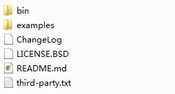

项目经常用到把当前页面导出为pdf，或者生成某个页面或部分的快照。如果是简单的页面快照，不没有太多的渲染，可以用`html2canvas.min.js`导出图片或者`html2pdf.bundle.min.js `导出为pdf，仅仅在前端就可以完成。但是复杂的页面，以上的导出效果不好，质量也不高。因此我采用`PhantomJS`，用后台生成pdf、png等进行导出。

### 1.PhantomJS简介

> PhantomJS是一个基于webkit的JavaScript API。它使用QtWebKit作为它核心浏览器的功能，使用webkit来编译解释执行JavaScript代码。任何你可以在基于webkit浏览器做的事情，它都能做到。它不仅是个隐形的浏览器，提供了诸如CSS选择器、支持Web标准、DOM操作、JSON、HTML5、Canvas、SVG等，同时也提供了处理文件I/O的操作，从而使你可以向操作系统读写文件等。PhantomJS的用处可谓非常广泛，诸如网络监测、网页截屏、无需浏览器的 Web 测试、页面访问自动化等。

### 2.下载及安装

官方下载地址：[http://phantomjs.org/download.html](http://phantomjs.org/download.html)。目前官方支持三种操作系统，包括windows\Mac OS\Linux这三大主流的环境。根据运行环境选择要下载的包，下面以Windows7为例，我将phantomjs文件放置到D盘根目录下，里面的内容如下图。



### 3.如何使用

#### 1) 准备一个配置的js文件

在D盘phantomjs目录下新建一个`html2pdf.js`

```javascript
/**
 * phantomJs 脚本 html转图片
 */
var page = require('webpage').create(),
	system = require('system'), 
	address, output, size,JSESSIONID,domain;

if (system.args.length < 3 || system.args.length > 5) {
    phantom.exit(1);
} else {
 
    address = system.args[1];
    output = system.args[2];
	if(system.args.length>3){
		JSESSIONID = system.args[3];
		domain = system.args[4];
		
		 // 添加cookie
		phantom.addCookie({
			  "name":"JSESSIONID",
			  "value":JSESSIONID,
			  "domain":domain, 
			  "path":"/",
			  "httponly":false,
			  "secure":false,
			  "expires": "Fri, 01 Jan 2038 00:00:00 GMT"
		});
	}
    //定义浏览器宽高
    page.viewportSize = {
        width : 2048,
        height : 768
    }; 

	// 纸张尺寸
	page.paperSize = {
	 format: 'A3',
	 orientation: 'landscape',//横向
	  margin: { 
		left:"2cm", 
		right:"2cm", 
		top:"1cm", 
		bottom:"1cm" 
	  } 
 
	};  
    page.open(address, function(status) {
		 console.log('Status: ' + status);
		 if (status !== 'success') {
            console.log('Unable to load the address!');
            phantom.exit(1);
        } else {
            var bb = page.evaluate(function() {
			//var child=document.getElementById("printBt");
			//child.parentNode.removeChild(child);//此外可以写一些对页面操作的代码，比如词句代码是删除页面上的打印按钮
            return document.getElementsByTagName('html')[0].getBoundingClientRect();//返回内容就是要导出的范围（此处是HTML整页）
			});
			// 截取范围
			page.clipRect = {
				top : bb.top,
				left : bb.left,
				width : bb.width,
				height : bb.height
			};
			
			// 等待页面渲染
			window.setTimeout(function() {
				page.render(output, {format: 'pdf', quality: '100'});//这里配置导出的格式pdf,png等，quality为导出质量
				page.close();
				console.log('渲染成功...');
				phantom.exit();
			}, 2000);
        }
       
    });
}
address = system.args[1];//传入的URL地址
output = system.args[2];//保存的图片路径
```

#### 2）测试命令

 例如：phantomjs文件夹放于D盘根目录，在phantomjs/bin 目录下（也可以配置环境变量）打开控制台。以我的CSDN博客页面`https://blog.csdn.net/xiweiller`导出为PDF为例。输入如下命令:

``` shell
phantomjs.exe D:/phantomjs/html2pdf.js https://blog.csdn.net/xiweiller D:/phantomjs/blog.pdf
```

其中 `phantomjs.exe`是执行命令文件，  `D:/phantomjs/screenshot.js`是执行的配置js文件，`https://blog.csdn.net/xiweiller `是目标HTML，`D:/phantomjs/blog.pdf`是导出PDF的路径。

#### 3） java中的使用，springboot项目为例

- application.yml中添加配置，配置项为phantomjs执行文件路径

  ```yaml
  htmltopdf:
    path:
      windows: D:/phantomjs/bin/phantomjs.exe
      linux: /root/soft/phantomjs-2.1.1-linux-x86_64/bin/phantomjs
      mac:
  ```

- Html转Pdf工具类

  参数：

  	- htmlPath 目标网页访问地址
  	- pdfPath 导出pdf存放目录
  	- JSESSIONID  登陆认证时需要传递，用于cookie携带
  	- domain cookie中获取

```java
/**
 * Html转Pdf工具类
 *
 */
@Component
public class HtmlToPdf {
	
	@Value("${htmltopdf.path.windows}")
	private String WINDOWS_WKHTMLTOPDF_PATH;
	@Value("${htmltopdf.path.mac}")
	private String MAC_WKHTMLTOPDF_PATH;
	@Value("${htmltopdf.path.linux}")
	private String LINUX_WKHTMLTOPDF_PATH;
	private static Logger log = LoggerFactory.getLogger(HtmlToPdf.class);
	
	/**
	 * html转pdf核心方法
	 * @param htmlPath html路径（硬盘和网盘路径都支持）
	 * @param pdfPath pdf存储路径
	 * @return 转换成功：true，失败：false
	 */
	public  boolean convert(String htmlPath, String pdfPath,String JSESSIONID,String domain) {
		File file = new File(pdfPath);
		File parent = file.getParentFile();
		if (!parent.exists()) {// 如果pdf保存路径不存在，则创建路径
			parent.mkdirs();
		}
		String toolDir = null;//   转换工具在系统中的路径
		if (System.getProperty("os.name").indexOf("Windows") != -1) {//windows 系统
			toolDir = WINDOWS_WKHTMLTOPDF_PATH;
		}else if(System.getProperty("os.name").indexOf("Mac OS X") != -1){//mac 系统
			toolDir = MAC_WKHTMLTOPDF_PATH;
		}else if(System.getProperty("os.name").indexOf("Linux") != -1){//linux 系统
			toolDir = LINUX_WKHTMLTOPDF_PATH;
		}
		boolean result = true;//pdf创建成功标识，默认成功
		String BLANK = " ";//空格
		Process process = null;//图片输出路径
		StringBuffer sbf = null;
		InputStream is = null;

		StringBuilder cmd = new StringBuilder();
		cmd.append(toolDir)
				.append(BLANK)
				.append(new File(toolDir).getParent()).append(File.separator).append("html2pdf.js")
				.append(BLANK)
				.append(htmlPath)
				.append(BLANK)
				.append(pdfPath);
		if(JSESSIONID!=null){//添加cookie值
			cmd.append(BLANK).append(JSESSIONID);
			cmd.append(BLANK).append(domain);
		}
		try {
			log.info("报表准备导出 " );
			log.info("导出命令：{}",cmd.toString() );
			process = Runtime.getRuntime().exec(cmd.toString());// 输出路径

			is = process.getInputStream();
			BufferedReader br = new BufferedReader(new InputStreamReader(is));
			sbf = new StringBuffer();
			String tmp = "";

			while ((tmp = br.readLine()) != null) {
				sbf.append(tmp);
			}
			log.info("报表导出完成 " );
		} catch (IOException e) {
			result = false;
			log.error("报表导出失败！", e);
		} finally {
			if (is != null) {
				try {
					is.close();
				} catch (IOException e) {
					e.printStackTrace();
				}
				is = null;
			}
		}
		return result;
	}
}

```

- 转换工具的调用

  ```java
  	public void test( HttpServletRequest request ){
         		// 注意不同部署环境，路径不同。
  			String htmlUrl = "D:/phantomjs/html2pdf.js";
  			String pdfPath =  "D:/phantomjs/export.pdf"
  			String JSESSIONID = "";
  			String domain =  request.getServerName();
  			Cookie[] cookies = request.getCookies();
  			for(Cookie cookie :cookies){
  				if("JSESSIONID".equals(cookie.getName())){
  					JSESSIONID = cookie.getValue();
  				}
  			}
  			//将html转换为pdf文件
  			boolean isno =htmlToPdf.convert(htmlUrl,pdfPath,JSESSIONID,domain);
  	 }	
  ```


#### 4) 导出效果图


### 4. 注意事项

​	在实际项目使用时，我们必须保证页面异步加载的速度比较快，否则会出现页面渲染不完整的问题。因此在项目中，被导出的目标页面最好能做到快速响应，尽量减少异步请求加载，或者保证异步接口快速响应。