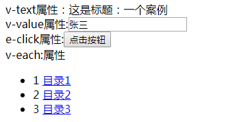

> 现在的项目大部分都是前后端分离的模式，作为后端开发者，喜欢用一些成熟的前端框架（如：`layui`）方便开发，尤其在前端工程师紧缺的情况下，后端开发者可以容易入手，后来又引入了`vue.js`使原有的HTML数据渲染和`js`动态操作更加快捷。但是在一次政府项目中，要求浏览器支持到`ie8`，这样`vue`支持的不好，因此将原来的`vue`写法改成原始`jquery`写法，为了改动最小化，便写了一个简单js，用于支持模板替换、el表达式解析等功能，我将名字命名为`wue.js`

## 1. 支持的模板

- `v-text` 标签内文本替换
- `v-value` 标签中value值替换
- `v-each` 标签内部节点遍历
- `i-value` `v-each`使用标签中循环子节点中使用，替换内部子节点value值
- `i-text` `v-each`使用循环子节点中使用，替换内部子节点内文本值
- `i-click` `v-each`使用循环子节点中使用，为内部子节点添加点击事件
- `e-click` 标签添加点击事件

## 2. HTML中模板的使用

1. 页面引入`jquery.min.js`和`wue.js` 

   查看文件[wue.js](../files/wue.js)

2. 定义一个wue实例，js标签写在HTML中的body内最底部。

   ```js
   	var vm_app = new Wue({
   
   		el:"#app",
   		data:{
   			title:"一个案例",
   			user:{
   					name:"张三",
   					age:25
   			},
   			menu:[
   					{"id":"bh1","name":"目录1"},
   					{"id":"bh2","name":"目录2"},
   					{"id":"bh3","name":"目录3"},
   			],
   		},
   		methods:{
   				init:function(){
   					this.replaceModel();
   				},
   				show:function(p){
   					alert(this.title+"--"+p)
   				}
   		}
   	
   	});
   	vm_app.init();
   	
   ```

   **参数说明：**

   - `el` dom选择器，限定模板的解析范围
   - `data` 数据定义
   - `methods` 方法定义
     - `init` 页面加载完成后的执行入口方法

    	

3. 页面定义模板

   模板均使用在HTML标签的属性中，模板名作为属性名，值中使用`双大括号`作为解析对象

   + `v-text`、`v-value`写法一样，例如`v-text="姓名-{{user.name}}"` ,`双大括号`中的内容，会使用`wue`实例中`data`内的值进行解析并替换，`双大括号`外的内容不解析。

   + `e-click`定义在属性中，为该标签添加点击事件，事件的函数可以使用多个参数，参数之间用`,`分隔，可以是变量取值，也可以是其他常量，例如`e-click="show(user.name)"`，`e-click="show('这是点击事件')"`，`e-click="sayUser('姓名',user.name,user.id)"`。

   + `v-each`写在循环体元素的父标签上，写法为`v-each="m,item in menu"`或`v-each="m in menu"`，字母`in` 前后分别为遍历的变量名、被遍历的数据集合，与`in`分别严格用一个空格` `隔开，变量名部分可以用`，`分隔，左侧为数据变量名，右侧为元数据对象，里面包含：索引值`index`，序号：`num`，总行数`count`。

     内部循环体元素定义时，需要添加隐藏属性`style="display:none"`，用于循环的 参照模板，它的属性中使用`i-text`、`i-value`进行文本和value属性赋值，取值对象则为自定义的循环变量或元数据变量，例如`i-text="{{item.num}}"`，`i-text="{{m.name}}"`，如果添加点击事件则使用`i-click`，例如`i-click="show(m.id)"`，`i-click="show('我是循环元素的点击事件')"`，事件的函数定义方式和`e-click`相同。

     

4. 使用`wue`的实例名，调用`init()`方法进行初始化，`init`方法内部为页面加载完成后要执行的逻辑，`this.replaceModel()`调用时执行模板解析和替换逻辑，`replaceModel()`方法可以携带一个参数，参数为dom选择器，如`replaceModel('#table')`，注意该选择器必须在`el`内部，表示仅解析或替换指定范围的模板。调用该方法根据逻辑需要，放于数据返回并已赋值给`wue`实例之后，赋值方法如`this.resultdata = r.data`。


## 3. 完整案例

```html
<!DOCTYPE html>
<html>
<head>
  <meta charset="utf-8">
  <title>el解析案例</title>
  <!-- 引入jQuery -->  
  <script src="js/jquery.min.js"></script>
  <!-- 引入自定义的wue.js -->
  <script src="js/wue.js"></script>

</head>
<body  >
  <div id="app">
	<div>
		v-text属性：<span v-text="这是标题：{{title}}">这是标题：</span>
	</div>
	<div>
		v-value属性:<input type="text" v-value="{{user.name}}"></input>
	</div>
	<div>
		e-click属性:<button   e-click="show('点击事件')">点击按钮</button>
	</div>
	<div>
		v-each:属性
		<ul v-each="m,item in menu">
			<li style="display:none"  >
				<span i-text="{{item.num}}"></span>
				<a  href="javascript:;" i-click="show(m.id)" i-text="{{m.name}}"></a>
			</li>
		</ul>
	</div>		
  </div>
 
<script>
	var vm_app = new Wue({
		el:"#app",
		data:{
			title:"一个案例",
			user:{
					name:"张三",
					age:25
			},
			menu:[
					{"id":"bh1","name":"目录1"},
					{"id":"bh2","name":"目录2"},
					{"id":"bh3","name":"目录3"},
			],
		},
		methods:{
				init:function(){
					this.replaceModel();
				},
				show:function(p){
					alert(this.title+"--"+p)
				}
		}
	
	});
	vm_app.init();
	
</script>
</body>
</html>
```

页面效果：




